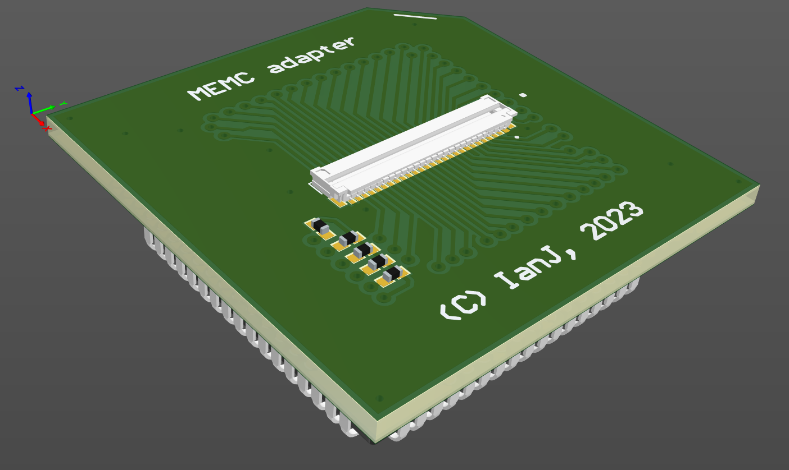

# MEMC plug to FFC adapter

April 2023

This project replaces an Acorn MEMC with a small PCB with 68way PLCC plug which routes the MEMC control signals to the new board where the MEMC would then be sited along with its RAM.

Note that the RAM address and control lines are not routed via the FFC, so any "on board" memory will be unused with this adapter.

The design has not yet been built / tested.

## Licence

No warranty is provided, and this work is used at your own risk.  

Licenced as CC BY-SA 3.0

Copyright 2023 Ian Jeffray

